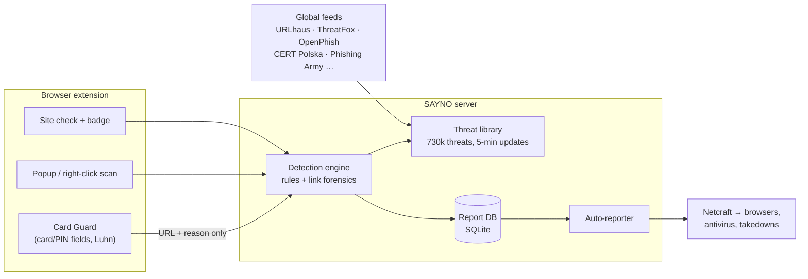

# SAYNO · SFU Hackathon Prep

## 1. One-line pitch
> **SAYNO is a browser extension that stops new bank customers from handing their card details to scammers.** It checks every site against 700,000+ live threats and blocks fake bank pages before the victim types their card. Every scam it catches is reported automatically, so it gets taken down for everyone.

## 2. The problem (your first 30 seconds)
- **Who gets targeted:** people with **new accounts** (new customers, international students, newcomers to Canada) and **high-balance accounts**. Their details leak from data breaches and get sold as lists. They don't yet know what their bank's real messages look like, and they're expecting messages ("activate your card", "set up e-Transfer").
- **How:** an SMS or e-mail ("your new debit card is locked", "you received an Interac e-Transfer", "CRA refund") leads to a fake page that asks for the card number, CVV, expiry and **PIN**.
- **Why SFU cares:** thousands of international students open their **first Canadian bank account** every September, and they're the classic target group.
- **Numbers to cite** (⚠ verify the latest figures on the Canadian Anti-Fraud Centre site before presenting): Canadians reported **about $638M** lost to fraud in 2024. The CAFC estimates only **5–10%** of fraud is ever reported.

## 3. What we built (and what's running)
| Layer | What it does |
|---|---|
| **Threat intelligence library** | Pulls 7 global feeds (abuse.ch URLhaus + ThreatFox, OpenPhish, Phishing Army, CERT Polska, Phishing.Database, disposable e-mail) and updates every **5 min**. It only downloads feeds that changed (ETag / If-Modified-Since). About 730k threats are kept in hidden, compressed storage. |
| **Detection engine** | Scores 0–100 using the blocklists plus 14 scam-language rules (including Canada-specific ones: Interac e-Transfer, CRA, new-card activation, card/PIN requests) and link forensics (look-alike domains like `rbc-card-activation.help`, punycode, raw IPs, risky TLDs, 53 impersonated brands including all major Canadian banks). |
| **Card Guard (extension)** | Finds card / CVV / PIN / SIN fields and card numbers being typed (Luhn check) and blocks the page if it looks fake. **Card data never leaves the browser.** |
| **Automatic reporting** | Dangerous links go to **Netcraft**, which feeds browser and antivirus blocklists and gets sites taken down, with no user action needed. Duplicates, known threats and private addresses are skipped. Failures are retried 3 times and every attempt is logged. |
| **Back office** | Private admin page: collected scams, confirm/dismiss, reporting log, JSON export. |

## 4. Live demo script (3 minutes)
Set up beforehand: the server is running (`start.bat`), the extension is loaded, and the three demo tabs are open.

1. **(0:00) Inbox:** open `/demo/inbox.html`. "This is what a new RBC customer receives in week one." Select the fake RBC SMS, right-click, and choose **Check with SAYNO**. It rates **HIGH** and explains why (urgency, account-lock threat, new-card activation, fake RBC domain).
2. **(0:40) The mom message:** check "Hi sweetie, dinner on Sunday". It scores **0 / safe**. Point out that false alarms matter as much as detections.
3. **(1:00) The trap:** open `/demo/fake-bank.html`. **Card Guard blocks the page:** "It asks for your PIN… bank-style pressure… not your bank's website." This is the wow moment, so pause here.
4. **(1:40) No false alarm:** open `/demo/shop.html`, a normal checkout, and type test card 4242 4242 4242 4242. No block, only a gentle reminder. "We protect without breaking shopping."
5. **(2:10) Community effect:** open `/admin?token=…` to show the collected items and the automatic reporting log. "Every user who meets a scam protects every other user."
6. **(2:40) Close:** "700k threats, updated every 5 minutes. Card data never leaves the device. Built for the people scammers target first."

**Backup plan:** record a screen video of this demo the night before. Venue Wi-Fi fails. The threat database runs from its local cache, so the demo also works offline.

## 5. Suggestions: what to add before or at the hackathon (ranked by impact vs. effort)
1. **Domain-age check (≈1 h, big impact).** Most phishing domains are under 30 days old. Look up the registration date over RDAP (`https://rdap.org/domain/<domain>`) and add +25 risk when a domain is under 30 days old. Judges love a signal they can understand.
2. **Cloud back end (≈3 h).** Today the extension talks to `127.0.0.1`. Deploy `server/app.py` (it's plain Python) to Render, Fly.io or a small VM so anyone can install the extension. Add an API key per install.
3. **Privacy-preserving URL lookups (talking point, ≈3 h).** For the cloud version, send only a **hash prefix** of the address, the way Google Safe Browsing and our password check do. Then the server never learns which sites users visit. This answers the privacy question before the judges ask it.
4. **Bank look-alike early warning (≈2 h).** Watch Certificate Transparency logs (a live feed of every new HTTPS certificate) for new domains containing `rbc`, `td`, `scotia`, `interac`, etc. That catches phishing sites *before* the first victim.
5. **Multilingual warnings (≈1 h with LLM help).** Vancouver newcomers: Mandarin, Punjabi, Farsi, Hindi, Korean, Tagalog, Spanish. The warning screen matters most in the user's first language.
6. **ML text classifier (≈3 h).** Train a small model (TF-IDF + logistic regression) on the public *UCI SMS Spam Collection* dataset plus your collected reports. Blend it with the rules and show both scores.
7. **Mobile / SMS (roadmap slide, not build).** Most of these scams arrive by SMS. An Android app with an SMS filter (or iOS Message Filter extension) using the same back end is the natural next product.
8. **Bank partnership (business slide).** Banks could flag "new account" or "high balance" customers for the stronger protection mode and publish official domain lists. SAYNO becomes a white-label product that banks give their customers.

## 6. Judge Q&A (practice these out loud)
| Question | Answer |
|---|---|
| *How is this different from Google Safe Browsing?* | Safe Browsing only knows a page once it's listed. Card Guard reacts to **behaviour**: a page asking for your PIN is blocked even if it was created 5 minutes ago. We also cover SMS / e-mail text, Canada-specific scams, and we **report** new sites back to the ecosystem. |
| *Privacy? You see my browsing?* | Card numbers never leave the page; only a yes/no signal does. Today the server runs locally. The cloud version uses hash-prefix lookups (roadmap #3). The passwords check already works this way (k-anonymity). |
| *False positives?* | Trusted list of official bank domains and payment processors. Normal checkouts aren't blocked (demo step 4). Every block explains why and has "continue anyway". The admin can dismiss mistakes. |
| *Can scammers abuse auto-reporting?* | Only high-risk items are reported, known threats and private addresses are skipped, each link is sent once, and Netcraft verifies before any takedown. |
| *Why an extension and not an app?* | Fastest path to a working product this weekend; the fake-bank pages open in a browser even when the lure is an SMS. Mobile is next (roadmap #7). |
| *Business model?* | Free for individuals. Paid white-label for banks and credit unions (Vancity, Coast Capital) as part of new-customer onboarding. Universities can offer it to international students. |
| *What's the tech stack?* | Python standard library (no dependencies), SQLite, and a Manifest V3 extension in vanilla JS. The threat data comes from open feeds maintained by abuse.ch, CERT Polska and others. |
| *What would you do with more time?* | Roadmap #1–#4, a usability study with SFU international students, and then a bank pilot. |

## 7. Honest limitations (say them before a judge does)
- Rules can miss cleverly worded scams (hence the ML roadmap). Brand-new sites that ask for nothing sensitive may pass.
- The extension currently needs the local server (cloud deployment is roadmap #2).
- Auto-reporting to Netcraft needs `reporter_email` set in `config.json`.

## 8. Slide outline (6 slides, ≤ 5 min)
1. **Hook:** a real-looking "Your new RBC debit card is locked" SMS on a phone mockup. "Would you click?"
2. **Problem:** who's targeted (new and high-balance accounts), the CAFC numbers, international students.
3. **Live demo** (section 4).
4. **How it works:** architecture diagram (below) plus "700k threats · 5-min updates · card data never leaves the device".
5. **Impact & roadmap:** community reporting loop, mobile, bank partnership.
6. **Team + ask:** "We want to pilot this with SFU International and a local credit union."

## 9. Day-of checklist
- [ ] Set `reporter_email` in `config.json` (the team's project e-mail) so auto-reporting is live.
- [ ] Clear the demo data: back office → dismiss, or delete `server/shieldlib/.data/reports.db`.
- [ ] Start the server 5 minutes early so the threat database is fresh. Check that the header shows "🟢 Protected".
- [ ] Browser zoom at 125%, notifications off, bookmarks bar hidden, demo tabs pre-opened.
- [ ] Backup demo video on a USB stick and in the cloud.
- [ ] One teammate presents, one drives the demo, one handles Q&A.
